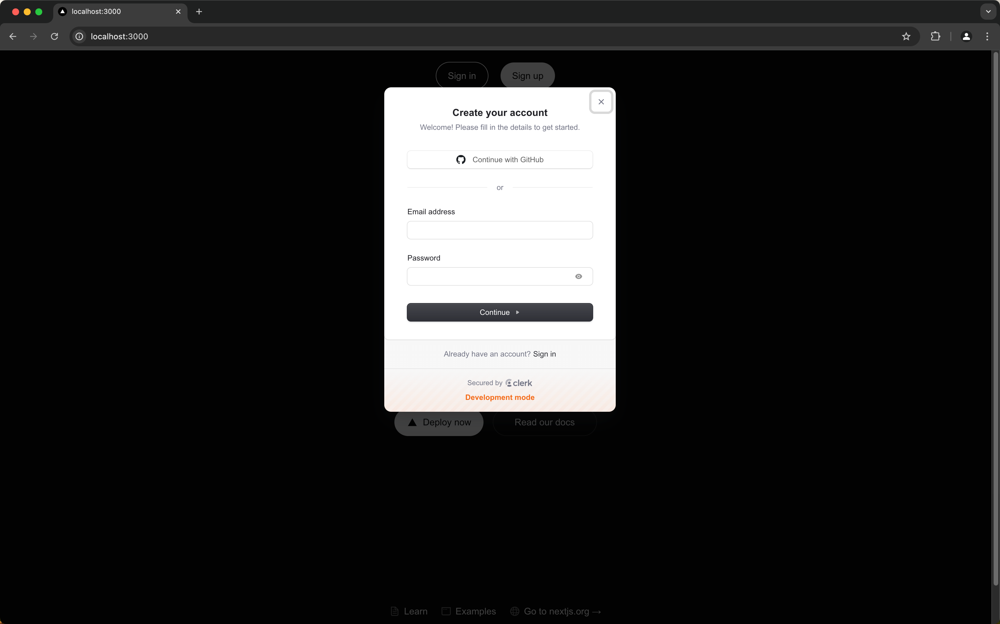
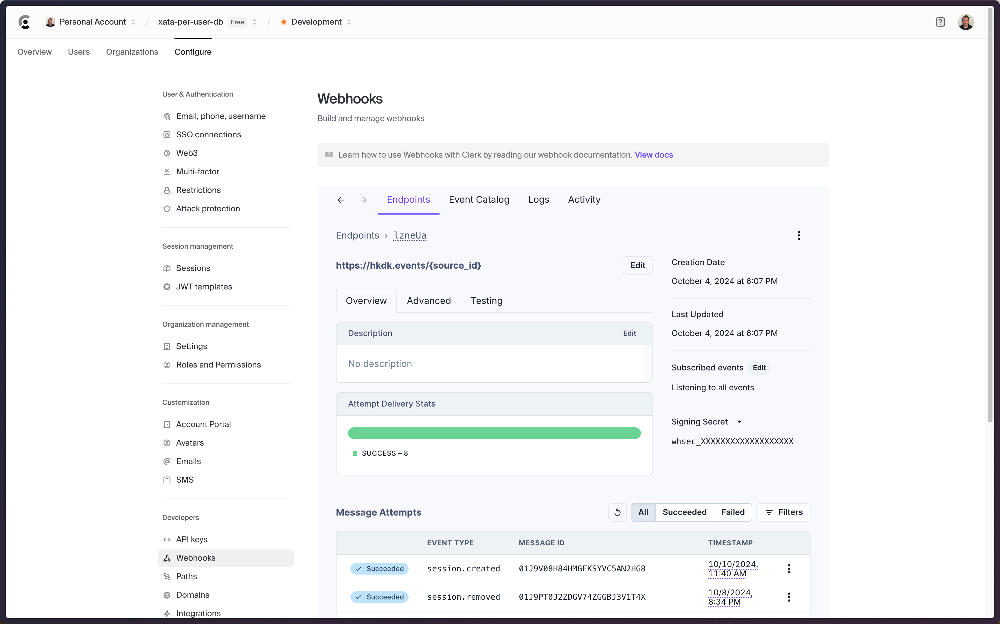
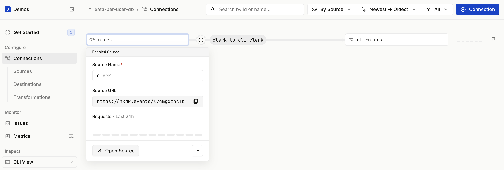
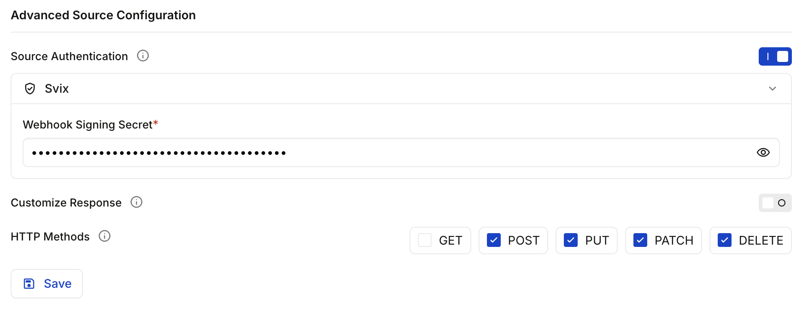
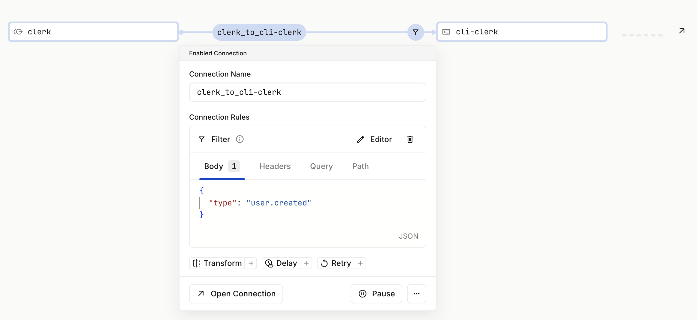
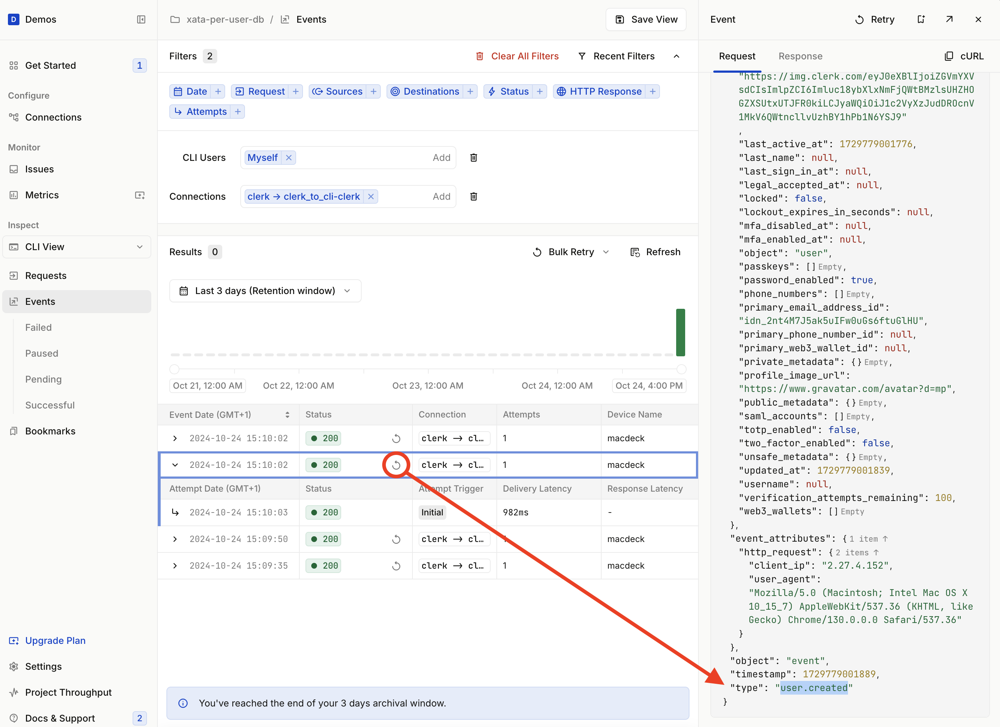

# Per-User Database Architecture with Xata, Clerk, Hookdeck, and Next.js

When building an application you often think of having a database with a table named `users` and then throughout your database schema you have references to `users` that represent the owner of a row in each referencing table. This works in many cases. However, there are a growing number of use cases where there is a need to have a database. For example, where there is a need for data isolation for security or compliance, and to maximize database access times. Also, when you think about it, this removes a lot of the complexity that comes from all those `users` references.

In this tutorial, you'll learn of some uses cases where a per-user database architecture makes sense and then walk through how to create a new Xata database per-user whenever a new user is created in [Clerk](https://clerk.com) using Clerk webhook notifications with the [Hookdeck event gateway](https://hookdeck.com?ref=xata-user-db) to help both during development with localhost webhook tooling and in production to secure the webhooks and guarantee at-least-once delivery. You'll build the app in Next.js.

## The use cases for a per-user database architecture

As mentioned, a per-user database architecture is often required to guarantee data isolation which enables security and compliance considerations such as access control and data residency. The location of the database can also improve data access performance.

Here are some concrete examples of where a per-user or per-device database makes sense:

- **Software as a Service (SaaS) Platforms**: Each tenant can have their own database to ensure data isolation and security. This setup is advantageous for businesses like Fogbugz, which uses a database per-customer model to manage isolated customer data efficiently.

- **Healthcare Systems**: Per-user databases can securely store sensitive patient data, ensuring compliance with privacy regulations like HIPAA. This approach allows for personalized care and easy retrieval of patient records.

- **Financial Services**: Online banking and fintech platforms can benefit from per-user databases by securely managing individual financial data. This setup enhances security and simplifies the process of auditing and compliance

- **E-commerce Platforms**: Each customer can have a separate database to manage their order history, preferences, and personal information. This helps in providing personalized shopping experiences and targeted marketing.

- **Social Media Applications**: Per-user databases can handle vast amounts of unstructured data, such as posts and interactions, while maintaining user privacy and providing personalized content feeds.

- **IoT Applications**: Per-device databases can manage data from individual sensors or devices, allowing for real-time analytics and efficient data processing.

## Build a per-user database architecture with Xata, Clerk, Hookdeck, and Next.js

### Before you begin

You'll need a free account with the following services:

- [Clerk](https://clerk.com)
- [Xata](https://xata.io)
- [Hookdeck](https://hookdeck.com?ref=xata-user-db)

### Tech Stack

You'll use the following technologies in this guide:

| Technology | Description                                                                                                                |
| ---------- | -------------------------------------------------------------------------------------------------------------------------- |
| Xata       | Serverless Postgres database platform for scalable, real-time applications.                                                |
| Clerk      | Platform that provides user authentication and management services                                                         |
| Hookdeck   | Provides tools and infrastructure for reliable asynchronous messaging, debugging, and scaling.                             |
| Next.js    | A React framework for building fast, user-friendly web applications with server-side rendering and static site generation. |

## Steps

### Install and configure the Hookdeck CLI

Install the Hookdeck CLI that provides localtunnel functionality allowing webhooks to be received on your localhost:

```

npm i -g hookdeck-cli

```

And login:

```sh
hookdeck login
```

When prompted, open the browser window and authenticate the Hookdeck CLI.

### Scaffold a Next.js app

Next, create the basic Next.js application.

Run the following and accept all defaults:

```sh
npx create-next-app@latest xata-per-user-db
```

Navigate to the new app directory:

```sh
cd xata-per-user-db
```

### Add Clerk

Clerk has a Next.js SDK with in-build React components to support user authentication and management.

Install the [Clerk Next.js package](https://clerk.com/docs/references/nextjs/overview):

```sh
npm install @clerk/nextjs
```

Go to the [Clerk dashboard](https://dashboard.clerk.com/), and head to the **Configure** section. Then click on **API keys** under the **Developers** heading. Copy the **Publishable key** and **Secret key -> default** values and add them to a new `.env.local` file within your application:

```
NEXT_PUBLIC_CLERK_PUBLISHABLE_KEY=...
CLERK_SECRET_KEY=...
```

Next, add the Clerk middleware. If you're using a `src` directory it does in there, otherwise in the root directory of your project:

```ts
import { clerkMiddleware } from "@clerk/nextjs/server";

export default clerkMiddleware();

export const config = {
  matcher: [
    // Skip Next.js internals and all static files, unless found in search params
    "/((?!_next|[^?]*\\.(?:html?|css|js(?!on)|jpe?g|webp|png|gif|svg|ttf|woff2?|ico|csv|docx?|xlsx?|zip|webmanifest)).*)",
    // Always run for API routes
    "/(api|trpc)(.*)",
  ],
};
```

Update `layout.tsx` to the following:

```tsx
import {
  ClerkProvider,
  SignInButton,
  SignedIn,
  SignedOut,
  UserButton,
} from "@clerk/nextjs";
import "./globals.css";

export default function RootLayout({
  children,
}: {
  children: React.ReactNode;
}) {
  return (
    <ClerkProvider>
      <html lang="en">
        <body>
          <header>
            <SignedOut>
              <SignInButton mode="modal" />
              <SignUpButton mode="modal" />
            </SignedOut>
            <SignedIn>
              <UserButton />
            </SignedIn>
          </header>
          <main>{children}</main>
        </body>
      </html>
    </ClerkProvider>
  );
}
```

This adds the Clerk provided sign in and sign out functionality.

Add the following to `global.css` to improve the button styling a little:

```css
header {
  text-align: center;
  margin-top: 20px;
  display: flex;
  gap: 20px;
  justify-content: center;
}

header button {
  border-radius: 128px;
  height: 48px;
  padding: 0 20px;
  border: 1px solid transparent;
  cursor: pointer;
  font-size: 16px;
  background: var(--background);
  border-color: var(--gray-alpha-200);
}

header button:last-of-type {
  background: var(--foreground);
  color: var(--background);
}
```

#### Test the Next.js application

Run the application:

```sh
npm run dev
```

Head to localhost:3000 and click on the **Sign In** and ensure you go to the Clerk sign in modal appears. **Don't complete the sign in / sign up flow yet!**



#### Add the Clerk webhook route

Next, create a webhook handler route to be used to handle the Clerk webhook when a new user is created.

Install the Hookdeck SDK to be used to verify the webhook:

```sh
npm i @hookdeck/sdk
```

Create a file `app/webhooks/clerk/route.ts`:

```ts
import { NextRequest, NextResponse } from "next/server";
import { verifyWebhookSignature } from "@hookdeck/sdk/webhooks";

const HOOKDECK_WEBHOOK_SECRET = process.env.HOOKDECK_WEBHOOK_SECRET;

if (!HOOKDECK_WEBHOOK_SECRET) {
  console.error("Please set HOOKDECK_WEBHOOK_SECRET environment variable");
  process.exit(1);
}

export async function POST(request: NextRequest) {
  try {
    const headers: Record<string, string> = {};
    request.headers.forEach((value, key) => {
      headers[key] = value;
    });

    const rawBody = await request.text();

    const verificationResult = await verifyWebhookSignature({
      headers,
      rawBody,
      signingSecret: HOOKDECK_WEBHOOK_SECRET!,
    });

    if (!verificationResult.isValidSignature) {
      console.error("Invalid signature");
      return NextResponse.json({ error: "Invalid signature" }, { status: 401 });
    }

    const event = JSON.parse(rawBody);

    console.log("Received event", event);

    return NextResponse.json(event);
  } catch (error) {
    console.error(error);
    return NextResponse.json({ error }, { status: 500 });
  }
}
```

In additional to the Next.js classes, import `verifyWebhookSignature` from `@hookdeck/sdk/webhooks` to verify webhook signatures.

Next, retrieve the `HOOKDECK_WEBHOOK_SECRET` from your environment variables. This secret is used to verify the webhook came from Hookdeck. If the secret is not set, log an error message and exit the process to prevent the server from running without the necessary configuration.

Now, define an asynchronous function named `POST` to handle incoming `POST` requests. Inside this function, populate the `headers` variable with key-value pairs of request headers.

Read the raw body of the request using await `request.text()`.

Use the `verifyWebhookSignature` function to verify the webhook signature. Pass the `headers`, `rawBody`, and the `HOOKDECK_WEBHOOK_SECRET` to this function. If the signature is invalid, log an error message and return a `401` response with an error message indicating an invalid signature.

If the signature is valid, parse the raw body to extract the event data (you need to do this rather than use `request.json()` as the request stream may have closed). Log the received event for debugging purposes.

Finally, return the event data as a JSON response. If any errors occur during the process, catch them, log the error, and return a `500` response with the error message.

Not that all responses go back to Hookdeck and not to Clerk.

#### Create a localtunnel with the Hookdeck CLI

Set up a localtunnel and Hookdeck connection to the webhook route:

```sh
hookdeck listen 3000 clerk --path /webhooks/clerk
```

Note: A path (`/webhooks/clerk`) can also be defined when creating a localtunnel with the Hookdeck CLI, which is different to the approach taken by other tools such as ngrok.

You will see output similar to the following:

```sh
Dashboard
👉 Inspect and replay events: https://dashboard.hookdeck.com?team_id={team_id}

Sources
🔌 clerk URL: https://hkdk.events/{source_id}

Connections
clerk -> clerk_to_cli-clerk forwarding to /webhooks/clerk

> Ready! (^C to quit)
```

Copy the **clerk URL** value that is output.

#### Configure Clerk webhooks

Head to the Clerk Dashboard and go to the **Webhooks** section.

Click **+ Add Endpoint** and enter the Hookdeck URL you copied in the previous step. You can ignore the **Subscribe** to event section and in doing so effectively subscribe to all events. We'll do the event filtering within Hookdeck. Click **Create** to create the webhook subscription.

In the following screen, copy the **Signing Secret**.



#### Verify the Clerk webhook within Hookdeck

Hookdeck can verify webhooks from number providers and also supports various common webhook verification standards. This allows you to offload the effort of maintaining a variety of webhook verification methods, enabling you to have one standard of webhook verification from Hookdeck within your codebase.

Go to the [Hookdeck Dashboard](https://dashboard.hookdeck.com?ref=xata-user-db), click on **Connections**. Click on the visual representation of the Clerk Source named `clerk` to open the dialog. Click **Open Source**.



Scroll to the **Advanced Source Configuration** section and enable **Source Authentication**. Select **Svix**, the provider Clerk uses for outbound webhooks, from the dropdown, and populate the **Webhook Signing Secret** text field with the Clerk webhook signing secret you copied earlier. Click **Save**.



#### Trigger the Clerk webhook

You now have Clerk webhooks configured to be sent to Hookdeck and the Hookdeck CLI connected to receive webhooks on your localhost.

Head back to your application in your browser and complete the sign up / sign in flow.

Depending on your method of signup, you will receive at least two webhook events in your local application via Hookdeck.

1. `user.created`
2. `session.created`

Go back to the Hookdeck Dashboard, go to the **Events** section, and ensure the dropdown under the **Inspect** section on the left is set to **CLI View**. You will see the received events in the tabular view:


Note: Hookdeck has the concept of Requests which then generate Events. Read more about [Hookdeck Concepts](https://hookdeck.com/docs/hookdeck-basics?ref=xata-user-db#concepts).

#### Filter Clerk webhooks with Hookdeck Filters

Since you only want to create a database for each new user, set up a Hookdeck Filter to only allow `user.created` Clerk webhook events.

Go back to the **Connections** section within the Hookdeck Dashboard. Click the Connection, this is the line with the `clerk_to-cli-clerk` label. This opens a dialog that show the **Connection Name** and [Connection Rules](https://hookdeck.com/docs/connections?ref=xata-user-db#connection-rules).


Then click the **Filter +** button. Enter the following filter in the text area:

```json
{
  "type": "user.created"
}
```

Click **Save**.



This filter ensures that only webhooks events with a `type` property that has a value of `user.created` will result in an event being delivered to the Next.js application.

Test by creating a new user and checking which events reach your app.

### Add Xata to the Next.js application

Go to the your [Xata workspaces](https://app.xata.io/workspaces) and ensure you are within the correct workspace. Go to the **Settings** section and get your API Key and **Workspace slug**.

Also, go to the **Account Settings** section from the menu under your avatar. Scroll to the **Personal API keys** section, click **+ Add a key** and enter `per-user-db-app`, and click **Save**. Copy the newly created API key.

Save the **Workspace slug** value as `XATA_WORKSPACE_SLUG` and the Xata API key as `XATA_API_KEY` in your `.env.local` file:

```diff
NEXT_PUBLIC_CLERK_PUBLISHABLE_KEY=...
CLERK_SECRET_KEY=...
+
+ XATA_API_KEY=...
+ XATA_WORKSPACE_SLUG=...
```

Install the Xata TypeScript client:

```sh
npm i @xata.io/client
```

Update `route.ts` to import the `XataApiClient`, get the Xata credentials, and create a Xata client instance:

```ts
import { NextRequest, NextResponse } from "next/server";
import { verifyWebhookSignature } from "@hookdeck/sdk/webhooks";
import { XataApiClient } from "@xata.io/client";

const HOOKDECK_WEBHOOK_SECRET = process.env.HOOKDECK_WEBHOOK_SECRET;

if (!HOOKDECK_WEBHOOK_SECRET) {
  console.error("Please set HOOKDECK_WEBHOOK_SECRET environment variable");
  process.exit(1);
}

const XATA_API_KEY = process.env.XATA_API_KEY;
const XATA_WORKSPACE_SLUG = process.env.XATA_WORKSPACE_SLUG;

const xata = new XataApiClient({
  apiKey: XATA_API_KEY,
});
```

### Create a new Xata database per-user

Update the `POST` route handler to create a new database in Xata for each new user using the Xata client:

```ts
export async function POST(request: NextRequest) {
  try {
    ...

    const event = JSON.parse(rawBody);

    const dbList = await xata.databases.getDatabaseList({
      pathParams: {
        workspaceId: XATA_WORKSPACE_SLUG!,
      },
    });

    console.log("Existing DB list", dbList);

    if (dbList.databases.find((db) => db.name === event.data.id)) {
      const msg = "User DB already exists";
      console.log(`${msg}:`, event.data.id);

      // Return 200 as the event is processed and we don't want Hookdeck to retry
      return NextResponse.json({ message: msg }, { status: 200 });
    }

    const createResult = await xata.databases.createDatabase({
      pathParams: {
        dbName: event.data.id,
        workspaceId: XATA_WORKSPACE_SLUG!,
      },
      body: {
        region: "us-east-1",
      },
    });

    console.log("Created DB", createResult.databaseName);

    return NextResponse.json(createResult);
  } catch (error) {
    console.error("Error creating DB", error);
    return NextResponse.json({ error }, { status: 500 });
  }
}
```

With the Xata client in place, retrieve the list of existing databases in your Xata workspace by calling `xata.databases.getDatabaseList`. Pass the `workspaceId` as a path parameter, which is retrieved from the environment variable `XATA_WORKSPACE_SLUG`.

The `event.data.id` is the ID of the user in Clerk, so this is a good value to use when creating a database.

First, check if a database with the same Clerk user ID already exists by using the find method on the `dbList.databases` array. If a database with the same name is found, log a message indicating that the user database already exists and return a 200 response with a message. This indicates to Hookdeck that the event is processed, and Hookdeck will not retry the webhook.

If the database does not already exist, create a new database by calling `xata.databases.createDatabase`. Pass the `dbName` and `workspaceId` as path parameters, and for the moment hard code the database region to `us-east-1`.

Finally, return the result of the database creation as a JSON response. If any errors occur during the process, catch them, log the error, and return a `500` response with the error message.

#### Use Hookdeck to replay the `user.created` Clerk event

When you previously created a user in Clerk by signing in, the webhook events were only logged by the Next.js application and a Xata database was not created.

Hookdeck provides the ability to retry and replay events, so we can replay these old events during development.

Head to the Hookdeck Dashboard, go to the **Events** section, find the `user.created` event, and click the replay icon to replay the event.



The following message will be logged to indicate the database is created:

```sh
User DB created: user_{id}
```

Head to the Xata dashboard and check the database was created.

Replay the `user.created` event again in Hookdeck and ensure that the `User DB already exists` message is logged.

```sh
User DB already exists: user_{id}
 POST /webhooks/clerk 200 in 652ms
```

And that's it! Every time a new user is created in Clerk, triggered by a new user sign up, a new per-user database is created in Xata.

You can test further by deleting both the database in Xata and the user in Clerk, and going through the sign up process again within your application.

## Example: Regional database creation

As mentioned, one of the use cases for creating a database per-user is to enable the data to be hosted in a specific region for data privacy or security reasons. So, here's an example of changing the database region based on an IP address lookup using the location the user signed up from. In a real world scenario, you'd ask the user where they want to host their data either during of after signup.

```ts
export async function POST(request: NextRequest) {
  try {
    const headers: Record<string, string> = {};
    request.headers.forEach((value, key) => {
      headers[key] = value;
    });

    const rawBody = await request.text();

    const verificationResult = await verifyWebhookSignature({
      headers,
      rawBody,
      signingSecret: HOOKDECK_WEBHOOK_SECRET!,
    });

    if (!verificationResult.isValidSignature) {
      console.error("Invalid signature");
      return NextResponse.json({ error: "Invalid signature" }, { status: 401 });
    }

    const event = JSON.parse(rawBody);

    const dbList = await xata.databases.getDatabaseList({
      pathParams: {
        workspaceId: XATA_WORKSPACE_SLUG!,
      },
    });

    console.log("Existing DB list", dbList);

    if (dbList.databases.find((db) => db.name === event.data.id)) {
      const msg = "User DB already exists";
      console.log(`${msg}:`, event.data.id);

      // Return 200 as the event is processed and we don't want Hookdeck to retry
      return NextResponse.json({ message: msg }, { status: 200 });
    }

    let dbRegion = "us-east-1";
    try {
      const ipLookupResponse = await fetch(
        `http://ip-api.com/json/${event.event_attributes.http_request.client_ip}`
      );
      const ipLookupData = await ipLookupResponse.json();

      switch (ipLookupData.continentCode) {
        case "EU":
          dbRegion = "eu-west-1";
          break;
        case "OC":
          dbRegion = "ap-southeast-2";
          break;
      }
    } catch (error) {
      console.error("Error looking up IP. Defaulting to US.", error);
    }

    const createResult = await xata.databases.createDatabase({
      pathParams: {
        dbName: event.data.id,
        workspaceId: XATA_WORKSPACE_SLUG!,
      },
      body: {
        region: dbRegion,
      },
    });

    console.log("Created DB", createResult.databaseName);

    return NextResponse.json(createResult);
  } catch (error) {
    console.error("Error creating DB", error);
    return NextResponse.json({ error }, { status: 500 });
  }
}
```

This example defaults to using the `us-east-1` region, but also performs an IP address lookup to determine a region closer to their location when they signed up.

It uses [ip-api](http://ip-api.com) which is free for non-commercial use and handily returns a `continentCode` which can use to determine the region where the database instance created.

## Conclusion

In this tutorial, you have learned the benefits and use cases of a per-user database architecture, particularly in scenarios requiring data isolation, security, and compliance.

You have also walked through the steps to set up a Next.js application integrated with Clerk for user management, Hookdeck for local development and reliable webhook handling, and Xata for database management.

You have configured Clerk webhooks to trigger a per-user database to be created within Xata for each new user. Additionally, you explored how to customize database creation based on user location. Xata makes the process of creating a per-user database simple and lightweight.

## More information

- [Per-user database with Clerk, Xata, and Hookdeck GitHub repo]()
- [Clerk docs](https://clerk.dev/docs)
- [Xata docs](https://xata.io/docs)
- [Hookdeck docs](https://hookdeck.com/docs?ref=xata-user-db)

## Where next?

We'd love to hear your feedback on this tutorial, learn more about your experiences with Xata, or discuss contributing a community blog or tutorial. Connect with us on [Discord](https://discord.com/invite/kvAcQKh7vm) or follow us on [X | Twitter](https://twitter.com/xata). Happy building 🦋
